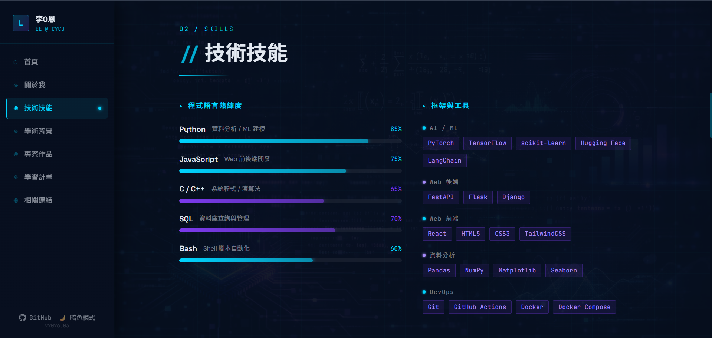
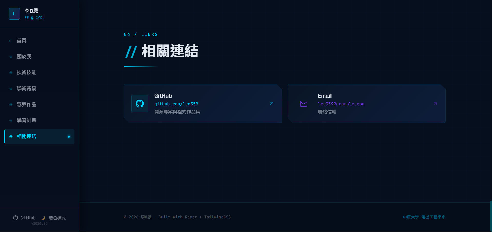

# 專案主題：個人技術履歷與作品集（Personal CV & Portfolio）

<!-- Badges: environment and tooling -->


## 1. 專案簡介

一個使用 Vite、React 與 TypeScript 建置的個人作品集（CV & Portfolio）前端專案。專案採用 Tailwind CSS、Radix UI 與多個自訂 UI 元件；`server/` 下包含一個可選的簡易 Express 伺服器，`build` 時會一併打包。


## 2. 環境需求

| 項目 | 版本需求 |
|------|---------|
| 作業系統 | Windows 10+ / macOS 12+ / Ubuntu 20.04+ |
| Node.js | 16+ |
| pnpm | 10+ |
| 瀏覽器 | Chrome 90+ / Firefox 90+ / Edge 90+（支援 Intersection Observer API） |
| 系統層套件 | 無額外必要依賴；Windows 建議安裝 Git for Windows 方便搭配 PowerShell 使用 |

## 安裝指令
 
```bash
git clone <https://github.com/lee359/Web_project.git>
cd <Web_project>
npx pnpm@latest install
npx pnpm@latest dev        
```

### 常見問題
 
**Q：執行 `npx pnpm@latest install` 時出現權限錯誤？**
 
- Windows：以系統管理員身份開啟 PowerShell 後重試
- macOS / Linux：在指令前加上 `sudo`

**Q：`node -v` 顯示版本低於 16？**
 
請重新安裝較新版本的 Node.js，或使用 [nvm](https://github.com/nvm-sh/nvm) 管理多個 Node.js 版本。
 
**Q：瀏覽器打開後畫面空白？**
 
確認終端機沒有顯示錯誤訊息，並確認瀏覽器版本符合需求（Chrome / Firefox / Edge 90+）。


## 4. 啟動與建置

### 開發模式

透過 Vite 啟動 React App。以下指令可直接在 Windows PowerShell 執行。

```powershell
npx pnpm@latest dev
```

### 建置版本

```powershell
npx pnpm@latest build
```

### 預覽已建置版本

```powershell
npx pnpm@latest preview
```

## 5. 預期畫面

- 啟動 `dev` 後，應在瀏覽器開啟 `http://localhost:5173/`，並顯示個人技術履歷與作品集首頁。
- 頁面會看到個人簡介、技能、教育背景、專案區塊與導覽側欄。
- 使用 `preview` 時，應能檢視 build 後的相同畫面。

### 預覽截圖






## 6. 專案結構
```
thu_web_HW/
├── client/                 ← 前端（Vite + React）
│   ├── src/
│   │   ├── main.tsx        ← 應用進入點（render `App`）
│   │   ├── App.tsx         ← 根元件與路由（`wouter`）
│   │   ├── components/     ← 共用 UI 元件
│   │   └── pages/          ← 頁面元件（Home、Projects、NotFound）
│   └── index.html / public/ ← 靜態資源
├── server/                 ← 可選的 Express 伺服器（build 時會 bundle 至 `dist/`）
├── doc/                    ← 專案文件（包含 `How to open preview.md`）
├── patches/                ← pnpm patched dependencies
├── package.json
└── README.md               ← 專案說明
```

## 7. 開發指令

- 應用入口：`client/src/main.tsx`（會 render `client/src/App.tsx`）
- 使用 `wouter` 作為 client-side 路由，並在 `client/src/contexts/ThemeContext.tsx` 提供主題（theme）上下文。
- 執行 TypeScript 型別檢查：

```bash
npx pnpm@latest run check
```

- 使用 Prettier 格式化程式碼：

```bash
npx pnpm@latest run format
```

## 8. 連結與補充

- 網站連結：<https://web666-project.netlify.app/>
- 預覽部署連結：<https://deploy-preview-2--web666-project.netlify.app/>
- 相關文件：`doc/How to open preview.md`

`package.json` 中的常用 scripts：

- `dev` — 啟動 Vite 開發伺服器
- `build` — 建置前端並 bundle server
- `preview` — 預覽 build 輸出
- `start` — 執行 production bundle (`node dist/index.js`)
- `check` — TypeScript 型別檢查
- `format` — Prettier 格式化


